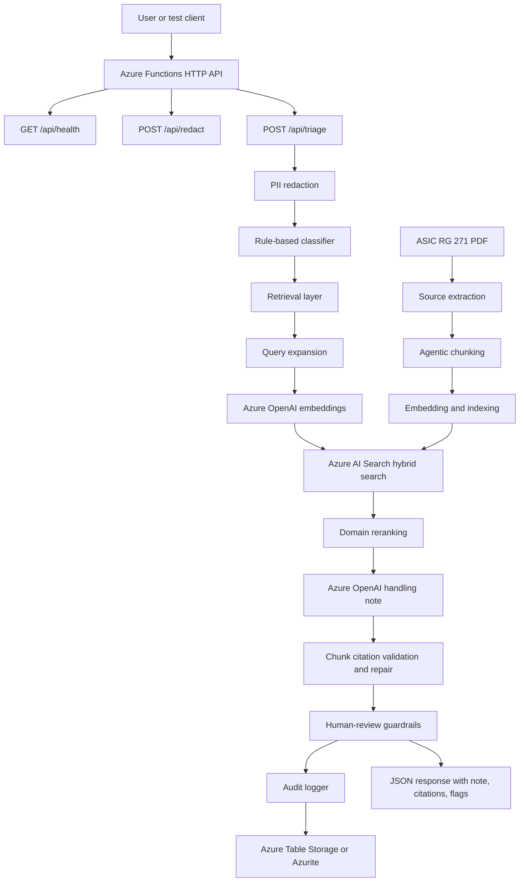

# RegDesk Azure RAG Copilot

RegDesk is a focused Azure RAG copilot for Australian financial-services
complaint handling. It takes a complaint, removes basic personal information,
classifies the issue, retrieves relevant ASIC RG 271 guidance from Azure AI
Search, generates a cited internal handling note with Azure OpenAI, and writes
a privacy-conscious audit record.

The system is intentionally conservative: it does not make final legal or
customer-outcome decisions. If the complaint type, received date, or applicable
timeframe is unclear, the response is flagged for human review.

## What The App Does

- Accepts complaint text through Azure Functions.
- Redacts common PII such as email addresses, phone numbers, and long IDs.
- Classifies the complaint with explainable keyword rules.
- Retrieves source chunks from an Azure AI Search vector index.
- Generates an internal handling note using only retrieved RG 271 context.
- Validates that model citations use supplied chunk IDs.
- Repairs malformed citations by asking the model for a corrected note.
- Flags responses for human review when regulatory certainty is insufficient.
- Stores an audit event in Azure Table Storage or Azurite without saving the
  original complaint text.

## Architecture



## Azure Services Used

| Service | Purpose In This Project |
| --- | --- |
| Azure Functions | Hosts the HTTP endpoints: `/health`, `/redact`, and `/triage`. |
| Azure OpenAI | Creates embeddings and generates cited handling notes. |
| Azure AI Search | Stores RG 271 chunks and runs hybrid keyword + vector retrieval. |
| Azure Storage Table | Stores privacy-conscious audit records. |
| Azurite | Local emulator for Azure Storage during development. |

## Repository Layout

- `function_app/`: Azure Functions app and runtime logic.
- `function_app/function_app.py`: HTTP endpoints and end-to-end triage workflow.
- `function_app/pii.py`: Lightweight PII redaction.
- `function_app/classifier.py`: Explainable complaint category classifier.
- `function_app/retrieval.py`: Query expansion, embeddings, Azure AI Search, and reranking.
- `function_app/generation.py`: Azure OpenAI note generation and citation guardrails.
- `function_app/audit.py`: Azure Table Storage audit logging.
- `ingestion/`: PDF extraction, source preparation, agentic chunking, and indexing.
- `eval/`: Lightweight golden-set checks against `/api/triage`.
- `demo/`: Streamlit client for manual triage testing.
- `infra/`: Azure CLI setup helper.
- `PROJECT_WALKTHROUGH_TR.md`: Turkish step-by-step project explanation.

## Configuration

Keep secrets out of git. Use `.env` for local Python scripts and
`function_app/local.settings.json` for Azure Functions local runtime.

Common local values:

```bash
AOAI_ENDPOINT=https://<openai-resource>.openai.azure.com
AOAI_KEY=<azure-openai-key>
AZURE_OPENAI_EMBEDDING_DEPLOYMENT=<embedding-deployment>
AZURE_OPENAI_CHAT_DEPLOYMENT=<chat-deployment>

SEARCH_ENDPOINT=https://<search-service>.search.windows.net
SEARCH_KEY=<search-key>
SEARCH_INDEX_NAME=reg-index

AzureWebJobsStorage=UseDevelopmentStorage=true
```

`SEARCH_KEY` is used for local development. The retrieval layer can fall back to
`DefaultAzureCredential` when a key is not supplied.

## Ingestion Flow

Run these steps when rebuilding the RG 271 knowledge base:

```bash
python ingestion/prepare_rg271.py
python ingestion/prepare_source_blocks.py
python ingestion/agentic_chunking.py --prepare-only
python ingestion/agentic_chunking.py
python ingestion/chunk_and_index.py
```

The pipeline:

1. Extracts text from the RG 271 PDF.
2. Builds traceable page/source blocks.
3. Creates small immutable source units.
4. Uses Azure OpenAI to group adjacent units into semantic chunks.
5. Reconstructs final chunk text from the original source units.
6. Embeds and uploads chunks into Azure AI Search.

## Run Locally

Install dependencies:

```bash
python -m pip install -r function_app/requirements.txt
```

If Azure Functions Core Tools uses a different Python worker locally, install
packages into the function package folder as well:

```bash
/opt/homebrew/bin/python3.14 -m pip install \
  -r function_app/requirements.txt \
  --target function_app/.python_packages/lib/site-packages \
  --upgrade
```

Start Azurite in one terminal:

```bash
azurite
```

Start the Function app in another terminal:

```bash
PYTHONPATH=/Users/osmanorka/azure-ai-copilot-platform-ya-da-azure-rag-copilot/function_app/.python_packages/lib/site-packages \
func start --script-root function_app --port 7071
```

Health check:

```bash
curl http://localhost:7071/api/health
```

Triage test:

```bash
curl -X POST http://localhost:7071/api/triage \
  -H "Content-Type: application/json" \
  -d '{"complaint":"The customer says they complained three weeks ago but the firm has not responded. Contact: test@example.com"}'
```

Expected critical fields:

```json
{
  "category": "service_delay",
  "classification_confidence": 0.8,
  "needs_human_review": true,
  "processing_stage": "azure_rag_with_guardrails"
}
```

## Run Evaluation

With Azurite and the Function app running:

```bash
python eval/run_eval.py
```

The eval posts golden complaints to `/api/triage` and checks stable fields such
as category, human-review flag, processing stage, redaction, citations, and key
handling-note terms.

## Audit Check

After a triage call, verify the local audit table:

```bash
python test_audit.py
```

Example successful output:

```text
AUDIT RECORDS: 1
CATEGORY: service_delay
NEEDS REVIEW: True
CITATIONS: rg271-0024,rg271-0022,rg271-0025,rg271-0023,rg271-0020
HASH PRESENT: True
```

## Streamlit Demo

```bash
python -m pip install -r demo/requirements.txt
streamlit run demo/app.py
```

The demo defaults to `http://localhost:7071/api/triage`.

## Safety Notes

- `.env` and `function_app/local.settings.json` are ignored because they may
  contain secrets.
- Local Azurite database files are ignored.
- The audit log stores a SHA-256 hash of the complaint, not the raw complaint.
- The generated note must cite supplied RG 271 chunk IDs.
- The app flags human review when key regulatory facts are unknown.
